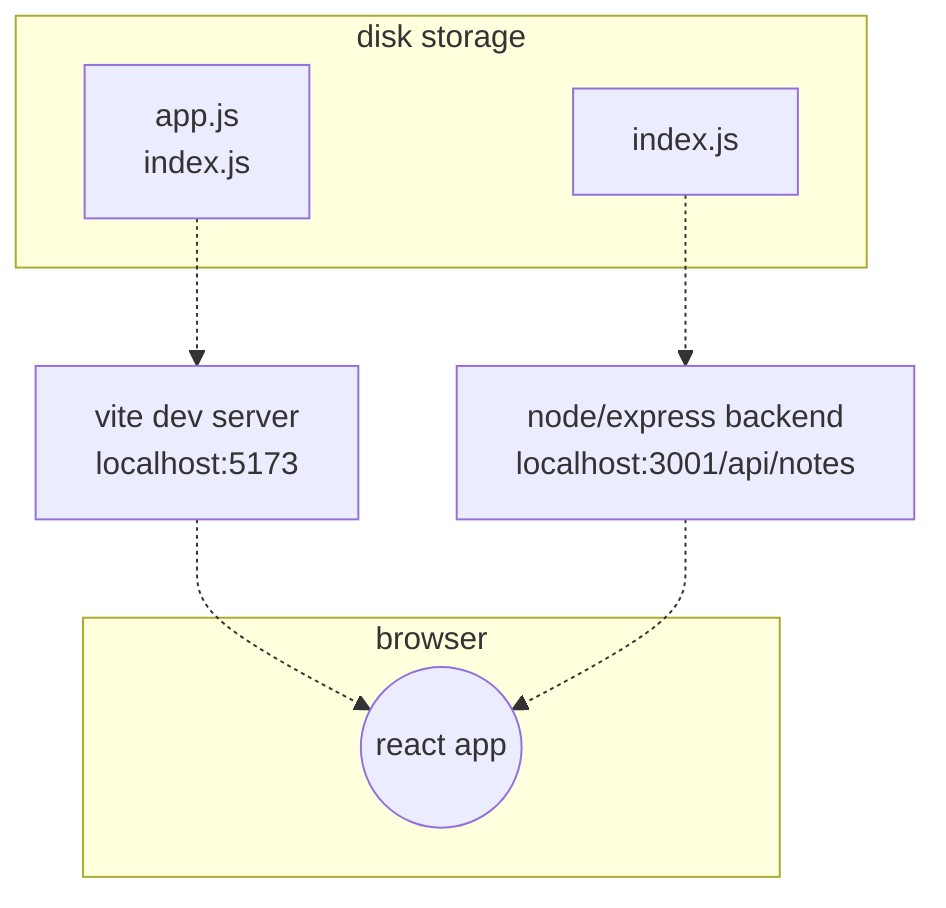

# Deploying app to internet

* React Frontend: http://localhost:5173 (Origin A - Port 5173)

* Express Backend: http://localhost:3001 (Origin B - Port 3001)

* Because the port numbers are different (5173 vs 3001), the browser's built-in Same-Origin Policy (SOP) security rule says:

    * "Warning! JavaScript running on Port 5173 is trying to steal data from Port 3001! I will BLOCK this request unless Port 3001 gives permission!"


## Same origin policy - (SOP) and CORS - (Cross origin Resource Sharing)

* The issue lies with a thing called **same origin policy**. A URL's origin is defined by the combination of protocol (AKA scheme),**_hostname_**, and **_port_**.

```
http://example.com:80/index.html
  
protocol: http
host: example.com
port: 80
```

* The **same-origin policy** is a _security mechanism implemented by browsers_ in order to prevent __session hijacking__ among other security vulnerabilities.

* In order to enable legitimate cross-origin requests (requests to URLs that don't share the same origin) W3C came up with a mechanism called CORS(Cross-Origin Resource Sharing)

    * A web page may freely embed cross-origin images, stylesheets, scripts, iframes, and videos.

* The problem is that, by default, the JavaScript code of an application that runs in a browser can only communicate with a server in the same origin. Because our server is in localhost port 3001, while our frontend is in localhost port 5173, they do not have the same origin.

* same-origin policy and CORS are not specific to React or Node. They are universal principles regarding the safe operation of web applications.

* We can allow requests from other origins by using **Node's cors middleware**.

* Same Origin, it must be the exact same machine, exact same domain/IP, and exact same port:

* take the middleware to use and allow for requests from all origins:

    ```js
    const cors = require('cors');
    app.use(cors())
    ```

---

## Basic App flow


---

## Application to the Internet

* Render (Cloud Hosting Platforms)

// 🚨 Right now you have:
const PORT = 3001;

// ✅ Change it to this (so Render can pick its own port in the cloud!):
const PORT = process.env.PORT || 3001;

## Frontend production build (Minified code)

* What happened to your nice React code?

    - When you write React, you write clean code with comments, spaces, and nice variable names like:

    ```js
    const handleCreateNewPerson = (newPersonObject) => { ... }
    ```

    * When you run npm run build, the build tool (Vite / Rollup) does 3 aggressive things.

        * **Deletes 100% of spaces, newlines, and comments**: Squeezes thousands of lines into 1 continuous line.

        * **Shortens all variable names**: Renames handleCreateNewPerson to e, newPersonObject to r, and response to t.

        * **Bundles 50 files into ONE single file**: Combines React, Axios, and all your components together.

* Why on earth does it do this?

    * SPEED & BANDWIDTH! 🚀

    * Your original human-readable code was 500 Kilobytes.

    * The minified alien code is only 30 Kilobytes!

* Humans NEVER read or edit minified code!

    * You write human code in src/.

    * Vite creates the alien code in dist/ automatically for the browser!

    * demo :-
    ```js
    !function(e){function r(r){for(var n,f,i=r[0],l=r[1],a=r[2],c=0,s=[];c<i.length;c++)f=i[c],o[f]&&s.push(o[f][0]),o[f]=0;for(n in l)Object.prototype.hasOwnProperty.call(l,n)&&(e[n]=l[n]);for(p&&p(r);s.length;)s.shift()();return u.push.apply(u,a||[]),t()}function t(){for(var e,r=0;r<u.length;r++){for(var t=u[r],n=!0,i=1;i<t.length;i++){var l=t[i];0!==o[l]&&(n=!1)}n&&(u.splice(r--,1),e=f(f.s=t[0]))}return e}var n={},o={2:0},u=[];function f(r){if(n[r])return n[r].exports;var t=n[r]={i:r,l:!1,exports:{}};return e[r].call(t.exports,t,t.exports,f),t.l=!0,t.exports}f.m=e,f.c=n,f.d=function(e,r,t){f.o(e,r)||Object.defineProperty(e,r,{enumerable:!0,get:t})},f.r=function(e){"undefined"!==typeof Symbol&&Symbol.toStringTag&&Object.defineProperty(e,Symbol.toStringTag,{value:"Module"})
    ```

---

## Rest All explain by mentor FSO hits with heavy Theroy

1. Serving Static Files: app.use(express.static('dist')) 📁

    * What is a "Static File"?
    > Files that don't change on the server: your compiled React index.html, main.js, and style.css sitting inside the dist folder.

    * What does app.use(express.static('dist')) do?
    > When someone opens http://localhost:3001 in Chrome:
        >> * Express looks inside the dist folder.
        >> * It finds index.html and hands it to the browser.
        >> * Result: Your entire React application opens directly from your Express server on Port 3001!

---

2. Relative URLs: baseUrl = '/api/persons' 🔗

    * In Part 2 (Development):

        - You had to write the full address:

        ```js
        const baseUrl = 'http://localhost:3001/api/persons';
        ```

    * In Production:

        * Because React and Express are now running on the exact same server, you don't need http://localhost:3001 anymore! You change it to a Relative URL:

        ```js
        const baseUrl = '/api/persons'; // 👈 Just the path!
        ```

    * Why Relative URLs are magic:
        * On your laptop, the browser automatically fetches: http://localhost:3001/api/persons.

        * When deployed on Render in the cloud, the browser automatically 
        fetches: https://your-app.onrender.com/api/persons!

        * You never have to change the URL again!

---

3. The Development Proxy in Vite (vite.config.js) 🔀

* Here is the developer dilemma: If we change baseUrl in React to '/api/persons', what happens when you run npm run dev in React on port 5173?

    * he browser tries to fetch http://localhost:5173/api/persons.

    * 404 Error! Because Vite on 5173 is just a frontend tool—it doesn't have your persons database!

* The Solution (The Proxy):

    - In your React project's vite.config.js, you add a Proxy rule:

        ```js
        server: {
        proxy: {
            '/api': {
            target: 'http://localhost:3001',
            changeOrigin: true,
            },
        },
        }
        ```
    
    * What this does: When you are coding on port 5173 and React asks for /api/persons, Vite secretly forwards that request to http://localhost:3001 behind the scenes!

    ### **Result** : You can keep baseUrl = '/api/persons' in React forever, and it works in BOTH Development and Production!

---

4. Deploying to Render.com ☁️

* When you deploy your phonebook-backend to Render:

    * Render runs npm install to download Express and CORS.

    * Render runs npm start (node index.js).

    * Express serves the dist/ folder (your React UI) and responds to /api/persons (your API).

    * Render gives you a live global link (e.g. https://phonebook-backend.onrender.com) that works on any phone in the world!


---

## Summary of the Whole Picture:

* React (part2/phonebook): Set baseUrl = '/api/persons' →→ Run npm run build →→ creates dist/.

* Backend (phonebook-backend): Copy dist/ into backend →→ Add app.use(express.static('dist')) →→ Push to GitHub.

* Render: Connect GitHub repo →→ Click Deploy →→ Your full-stack app is live on the internet!